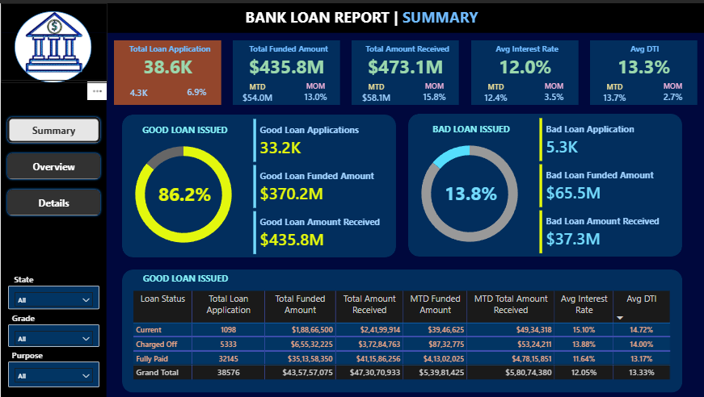
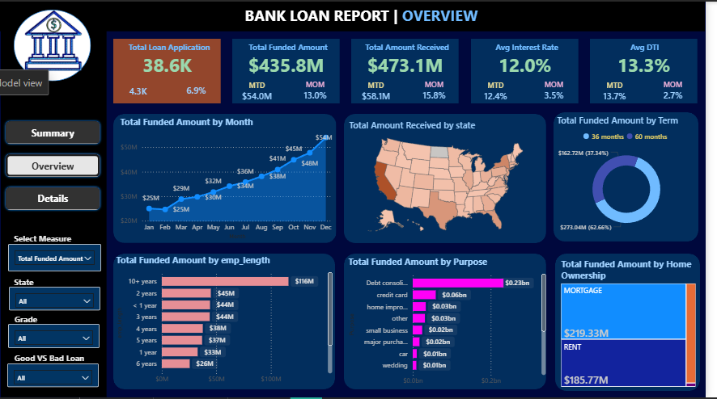
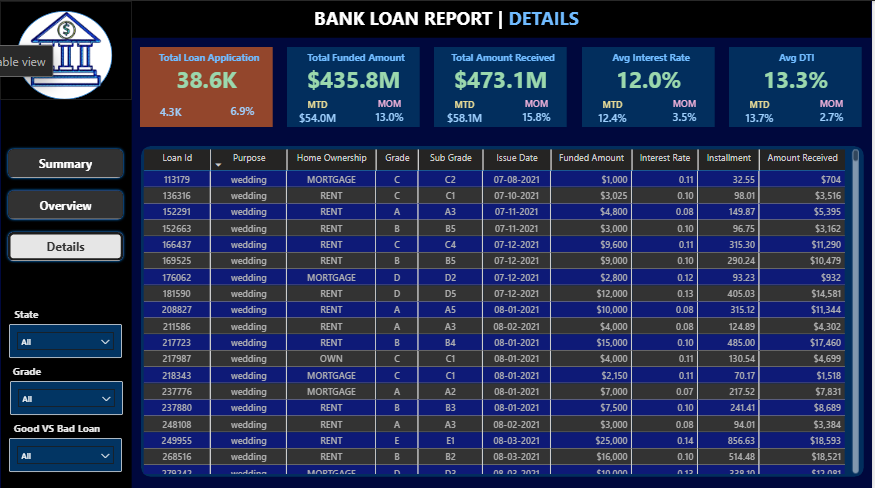

# 📊 Bank Loan Analysis Dashboard

## 📌 Project Overview

This project analyzes **bank loan data** to uncover insights into lending operations, borrower behavior, and loan performance. The analysis is performed using **SQL for data processing** and **Power BI for interactive visualization**.

The dashboard tracks important lending metrics such as loan applications, funded amounts, repayments, interest rates, and borrower risk indicators. It also highlights the distribution of **Good vs Bad loans**, helping financial institutions evaluate the health of their loan portfolio.

---

# 🚀 Project Objectives

* Analyze **loan application trends**
* Monitor **loan funding and repayment performance**
* Identify **Good vs Bad loans**
* Evaluate borrower financial health using **DTI and interest rates**
* Analyze loan distribution across **states, purposes, and employment length**

---

# 🛠 Tools & Technologies

| Tool        | Purpose                                   |
| ----------- | ----------------------------------------- |
| MYSQL       | Data storage and querying                 |
| SQL         | Data analysis and KPI calculations        |
| Power BI    | Data visualization and dashboard creation |
| CSV Dataset | Raw data source                           |

---

# 📂 Dataset Description

The dataset contains loan records with the following attributes:

* Loan ID
* Loan Amount
* Total Payment Received
* Interest Rate
* Debt-to-Income Ratio (DTI)
* Loan Status
* Borrower State
* Loan Term
* Employment Length
* Loan Purpose

---

# 📈 Key Performance Indicators (KPIs)

| Metric                  | Value   |
| ----------------------- | ------- |
| Total Loan Applications | 38.6K   |
| Total Funded Amount     | $435.8M |
| Total Amount Received   | $473.1M |
| Average Interest Rate   | 12.0%   |
| Average DTI             | 13.3%   |

---

# 📊 Loan Quality Analysis

| Loan Type  | Percentage | Funded Amount | Amount Received |
| ---------- | ---------- | ------------- | --------------- |
| Good Loans | 86.2%      | $370.2M       | $435.8M         |
| Bad Loans  | 13.8%      | $65.5M        | $37.3M          |

**Good Loans:** Fully Paid + Current
**Bad Loans:** Charged-Off

---

# 📊 Dashboard Pages

## 1️⃣ Summary Dashboard

This dashboard provides a high-level overview of loan performance:

* Total Loan Applications
* Total Funded Amount
* Total Amount Received
* Average Interest Rate
* Average DTI
* Good vs Bad Loan Ratio
* Loan Status Performance Table



---

## 2️⃣ Overview Dashboard

Provides deeper analytical insights including:

* Monthly Loan Funding Trend
* Loan Distribution by State
* Loan Term Analysis (36 vs 60 months)
* Loan Purpose Distribution
* Home Ownership Analysis
* Employment Length Analysis



---

## 3️⃣ Details Dashboard

This dashboard shows **record-level loan data** with filters allowing users to explore individual loan records.

Available filters include:

* State
* Loan Grade
* Good vs Bad Loan



---

# 🧮 Example SQL Queries

### Total Loan Applications

```sql
SELECT COUNT(loan_id) AS Total_Loan_Applications
FROM financial_loan;
```

### Total Funded Amount

```sql
SELECT SUM(loan_amount) AS Total_Funded_Amount
FROM financial_loan;
```

### Average Interest Rate

```sql
SELECT AVG(int_rate)*100 AS Avg_Interest_Rate
FROM financial_loan;
```

These queries were used to validate dashboard KPIs.

---

# 🔎 Key Insights

* Loan funding shows a **steady increase throughout the year**
* **Debt consolidation** is the most common loan purpose
* Borrowers with **10+ years of employment receive higher loan funding**
* **36-month loans dominate the portfolio**
* More than **85% of loans are Good Loans**

---

# ⚙️ Project Workflow

1. Import dataset into **SQL Server**
2. Perform **data analysis using SQL queries**
3. Validate KPIs and metrics
4. Connect SQL Server to **Power BI**
5. Build **interactive dashboards**

---

# 📁 Repository Structure

```
Bank-Loan-Analysis-Dashboard
│
├── README.md
├── financial_loan.csv
├── Bank Loan Analysis.pbix
├── SQL_Queries.sql
└── dashboard_images
      ├── summary.png
      ├── overview.png
      └── details.png
```

---

# 📥 How to Use This Project

Clone the repository:

```bash
git clone https://github.com/Krishagrawal-046/Bank-Loan-Analysis-Dashboard.git
```

Open the **Power BI (.pbix) file** to explore the dashboard and interact with filters.

---

# 👨‍💻 Author

**Krish Agrawal**  
B.Tech, NIT Raipur

⭐ If you found this project useful, consider giving it a **star**!
